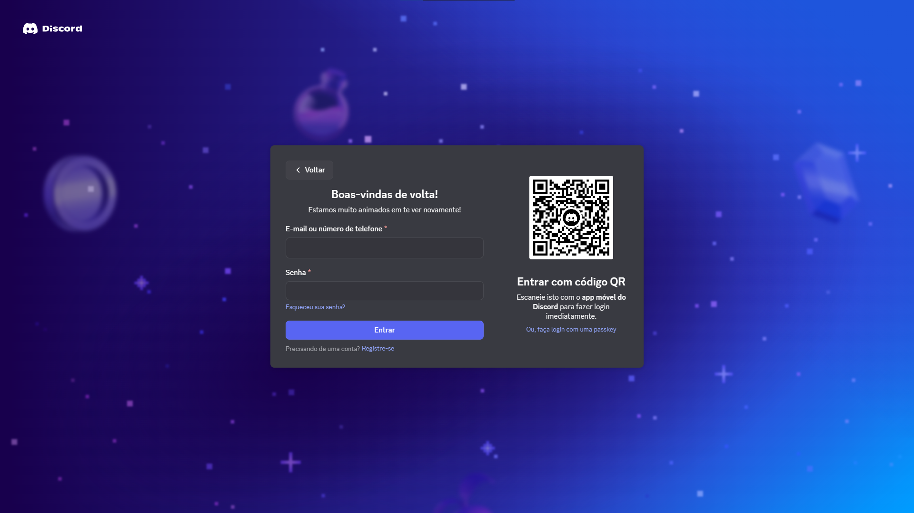
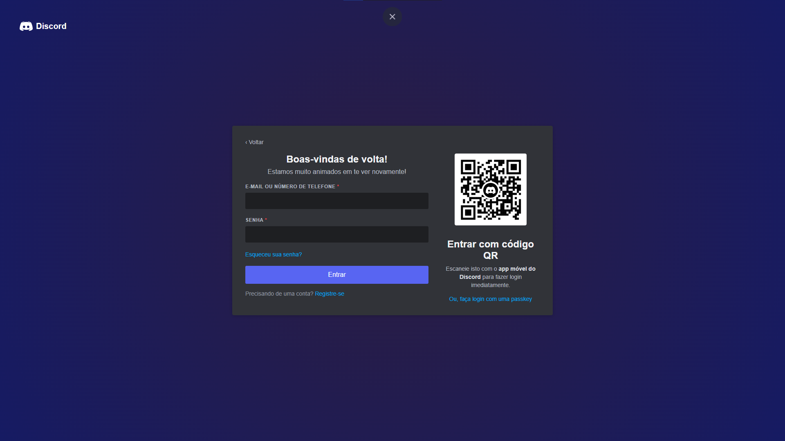

# 🔍 Investigação: O Crime da Página Clonada -- P1

## 🚀 Requisitos do Projeto Atendidos

- [x] **Gerenciamento de Estado:** Utilização do hook `useState` para capturar e controlar os inputs de e-mail e senha.
- [x] **Validação com Efeitos:** Implementação do hook `useEffect` acionado por um botão de disparo para validar se as credenciais digitadas estão corretas.
- [x] **Estilização Isolada:** Uso de CSS Modules (`Login.module.css`) para garantir a modularidade e evitar conflitos de escopo na estilização.
- [x] **Evidência do Clone:** Inclusão da imagem original utilizada como referência diretamente no repositório.

---

## 🛠️ Tecnologias Utilizadas

* **React.js** (Biblioteca principal)
* **CSS Modules** (Estilização isolada e escopada)
* **JavaScript (ES6+)**

---
## Original

## Clonado

